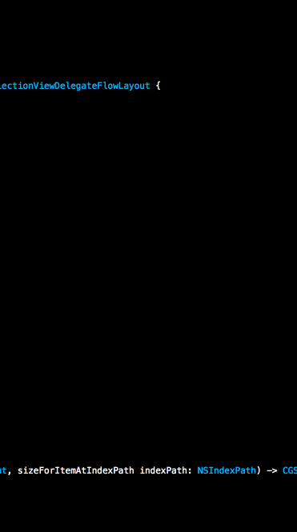

# Project 1 - *Flicks*

**Flicks** is a movies app using the [The Movie Database API](http://docs.themoviedb.apiary.io/#).

Time spent: **6** hours spent in total

## User Stories

The following **required** functionality is complete:

- [x] User can view a list of movies currently playing in theaters from The Movie Database.
- [x] Poster images are loaded using the UIImageView category in the AFNetworking library.
- [x] User sees a loading state while waiting for the movies API.
- [x] User can pull to refresh the movie list.

The following **optional** features are implemented:

- [ ] User sees an error message when there's a networking error.
- [x] Movies are displayed using a CollectionView instead of a TableView.
- [ ] User can select from a tab bar for either "Now Playing" or "Top Rated" movies.
- [ ] User can search for a movie.
- [x] All images fade in as they are loading.
- [ ] Customize the UI.

The following **additional** features are implemented:

- [ ] List anything else that you can get done to improve the app functionality!

## Video Walkthrough 

Here's a walkthrough of implemented user stories:

GIF created with [LiceCap](http://www.cockos.com/licecap/).

## Notes

I tried to implement search functionality, but I ran into some issues.

# Project 2 - *Flicks*

**Flicks** is a movies app displaying box office and top rental DVDs using [The Movie Database API](http://docs.themoviedb.apiary.io/#).

Time spent: **6** hours spent in total

## User Stories

The following **required** functionality is completed:

- [x] User can view movie details by tapping on a cell.
- [x] User can select from a tab bar for either **Now Playing** or **Top Rated** movies.
- [x] Customize the selection effect of the cell.

The following **optional** features are implemented:

- [x] For the large poster, load the low resolution image first and then switch to the high resolution image when complete.
- [x] Customize the navigation bar.

The following **additional** features are implemented:

- [x] After selecting a cell, I changed the navigation from push to modal so that the full high res poster can be viewed (without the nav bar) and added an 'x' button to return to the collection view.

## Video Walkthrough 

Here's a walkthrough of implemented user stories:

GIF created with [LiceCap](http://www.cockos.com/licecap/).

## Notes

I tried to figure out search, but I continued to run into problems. My main problem is getting the json data (like a specific movie's title) into an array of Strings or something that would be easier to work with search.

## License

    Copyright [2016] [Eric Suarez]

    Licensed under the Apache License, Version 2.0 (the "License");
    you may not use this file except in compliance with the License.
    You may obtain a copy of the License at

        http://www.apache.org/licenses/LICENSE-2.0

    Unless required by applicable law or agreed to in writing, software
    distributed under the License is distributed on an "AS IS" BASIS,
    WITHOUT WARRANTIES OR CONDITIONS OF ANY KIND, either express or implied.
    See the License for the specific language governing permissions and
    limitations under the License.
